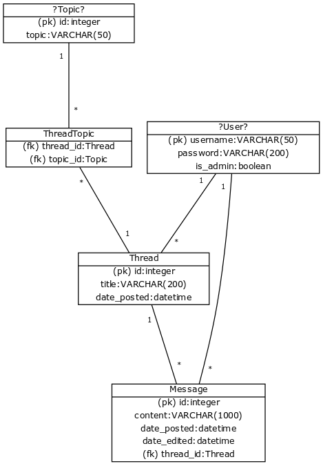

## Relational model for the forum database

Currently, only fields Thread and Message are used, and even their contents are likely to change. User- and Topic-tables are only more or less placeholders, and will get their final forms as user registration/authentication is implemented, and the final way to implment thread topics is decidend upon.

